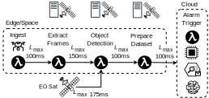

# HyperDrive Scheduler

HyperDrive is an SLO-aware scheduler for serverless functions specifically designed for the 3D continuum.

In the 3D continuum, which combines Cloud and Edge nodes on Earth and
satellites in space into a seamless computing fabric, workloads
can be executed on any of the aforementioned compute nodes,
depending on where it is most beneficial. However, scheduling on
LEO satellites moving at approx. 27,000 km/h requires picking
the satellite with the lowest latency to all data sources (ground
and, possibly, earth observation satellites). Dissipating heat from
onboard hardware is challenging when facing the sun and
workloads must not drain the satellite’s batteries.
HyperDrive places functions on Cloud, Edge, or Space
compute nodes, based on their availability and ability to meet the
SLO requirements of the workflow.

This is the source code repository with the HyperDrive scheduler simulator from our academic publication “HyperDrive: Scheduling Serverless Functions in the Edge-Cloud-Space 3D Continuum,” which has been accepted for presentation at the 2024 IEEE/ACM Symposium on Edge Computing (SEC).
Details on the architecture and the algorithms can be found in the [paper](https://arxiv.org/abs/2410.16026).
If you would like to cite our work, you can copy the plain text or the BibTeX citation below:

```
T. Pusztai, C. Marcelino, and S. Nastic, “HyperDrive: Scheduling Serverless Functions in the Edge-Cloud-Space 3D Continuum,” in 2024 IEEE/ACM Symposium on Edge Computing (SEC), 2024.
```

```
@inproceedings{HyperDrive2024,
 author = {Pusztai, Thomas and Marcelino, Cynthia and Nastic, Stefan},
 title = {HyperDrive: Scheduling Serverless Functions in the Edge-Cloud-Space 3D Continuum},
 booktitle = {2024 IEEE/ACM Symposium on Edge Computing (SEC)},
 year = {2024}
}
```


## Wildfire Detection Use Case

Early detection of wildfires in remote areas is critical to
mitigate their effects. Our motivating scenario involves using a
combination of drones, LEO satellites, and ground-based Edge
nodes that compose a serverless workflow for real-time wildfire
detection.
The drones operate in high-risk wildfire areas, such as California during the summer,
monitoring specific zones and capturing video and sensor data
to watch for signs of wildfires. They send the data to the
nearest Edge node using streaming frameworks or, when out of
range, transmit it to LEO satellites acting as in-orbit Edge nodes.
Once a fire is detected, LEO satellites incorporate satellite Earth
Observation (EO) data for processing. Our serverless workflow
processes the data close to the source to improve latency and
reduce network overhead. In some situations, functions are
executed directly on LEO satellites due to the data’s proximity
to EO data and the high latency associated with downloading
data to the ground.


The diagram below illustrates the functions of the serverless workflow.




## HyperDrive Simulator

This project contains a prototype of the HyperDrive scheduler implemented as a simulator, which uses [StarryNet](https://github.com/SpaceNetLab/StarryNet) as its base.

The experiments benchmark HyperDrive in various scenarios against the following baseline schedulers:

* Greedy First-fit
* Round-robin
* Random selection

To run the experiments, please ensure that you have Python 3.12 or higher installed, open a terminal in the root folder of the project, and execute the following command.

```sh
python ./run-scenario01.py
```
